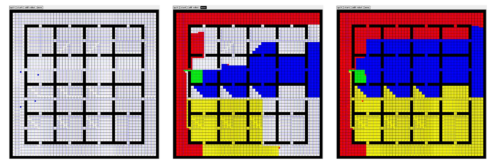

# Multi-Robot Forest Coverage
MATLAB implementation of the [Multi-Robot Forest Coverage](https://docs.opencv.org/4.x/hand-eye_figure.png) algorithm.

The implementation has been tested with the [Crazyswarm](https://crazyswarm.readthedocs.io/en/latest/) library. See a short demo at [MRFC](https://www.youtube.com/playlist?list=PLmnrq6M8StjtgaYCsmPYjuZKpv8Ebsukb).

## Citations
Xiaoming Zheng, Sonal Jain, S. Koenig and D. Kempe, "Multi-robot forest coverage," 2005 IEEE/RSJ International Conference on Intelligent Robots and Systems, 2005, pp. 3852-3857, doi: 10.1109/IROS.2005.1545323.

X. Zheng, S. Koenig, D. Kempe and S. Jain, "Multirobot Forest Coverage for Weighted and Unweighted Terrain," in IEEE Transactions on Robotics, vol. 26, no. 6, pp. 1018-1031, Dec. 2010, doi: 10.1109/TRO.2010.2072271.
